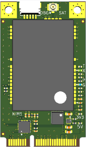
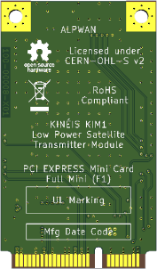
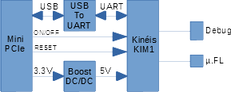

# Mini PCI Express Card / Kinéis KIM1 Satellite Transmitter

  

This card is a satellite modem that targets IoT applications. Some IoT applications may require 24/7 worldwide coverage, and cellular networks are not suitable since they may not provide coverage in remote locations, at sea, or at altitude. The only solution in that case is to go with satellite communication through thank to networks such as the ones provided by Kinéis. Available everywhere, low power consumption, simple, reliable and affordable.

Kinéis KIM1 is a low power transmitter module based on ARGOS-2 technology and fully-certified by the CNES. It enables communication with all the Kineis-Argos satellites to provide satellite connectivity and localization for IoT devices. The use of ARGOS RF signals and protocols ensures very low power consumption when sending data from anywhere around the world.

This card makes it easy to add a satellite modem to your projects thanks to it’s mini PCIe form factor and USB 2.0 interface.

more informations see www.kineis.com

# Key features and specifications

- Kinéis KIM1 Satellite Transmitter
- Small lightweight module for embedded applications
- Available everywhere
- RF output power capabilities up to 1W
- Low power consumption
- Frequency range 399.910 - 401.680MHz
- UART AT command interface
- Host interface : USB 2.0 via Mini PCIe socket
- Antenna : external via µ.FL connector (50Ω)

- Power Supply Voltage : +3.3V +/-5%
- Operating Current : 1.2A Transmit
- Form Factor : Mini PCI Express, full size
- Dimensions : 50.95 x 30.00 x 4.15mm
- Weight : TBD
- Operating Temperature Range : -20°C/+55°C
- Storage Temperature Range : -40°C/+85°C
- Humidity : 10% to 90%, non condensing

# Repository Contents

- /documentation : integration manual (with AT commands)
- /hardware : KiCad design files (BRD-00008-X01.zip)
- /hardware/ASY : ASY-00008-X01.zip --> send it to your assembly house
- /hardware/Datasheets
- /hardware/PCB : PCB-00008-X01.zip --> sent it to your pcb manufacturer
- /hardware/SCH : SCH-00008-X01 --> engineering team 

# License information

This product is open source.

Please review the LICENSE.md file for license information.

Distribute as-is, no warranty is given.

# Support

If you have some questions, please contact support(at)alpwan.fr

